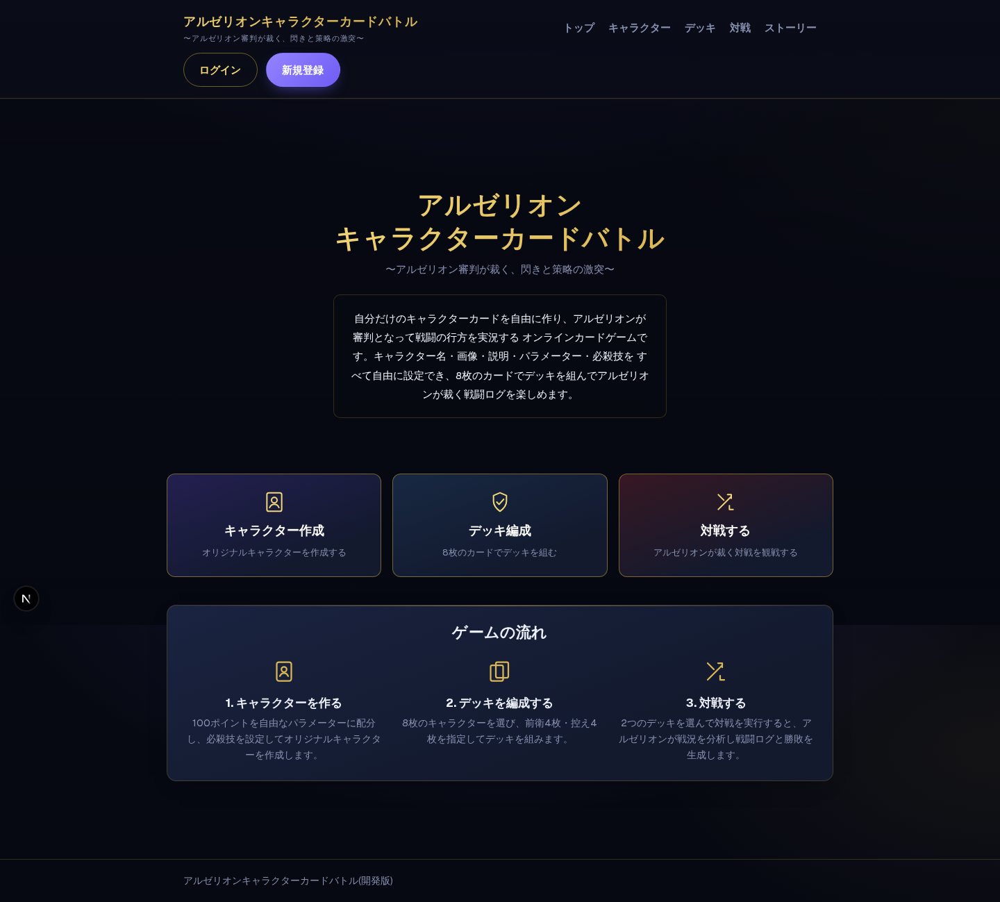
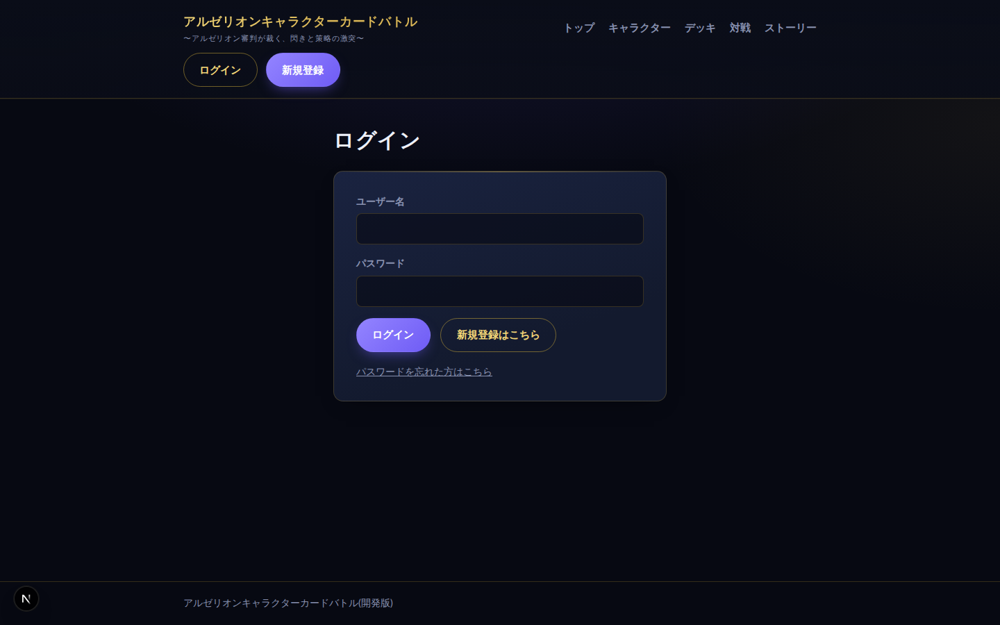
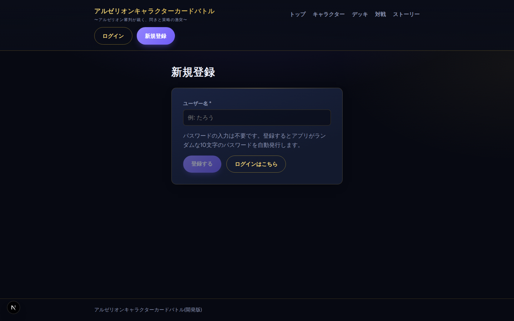
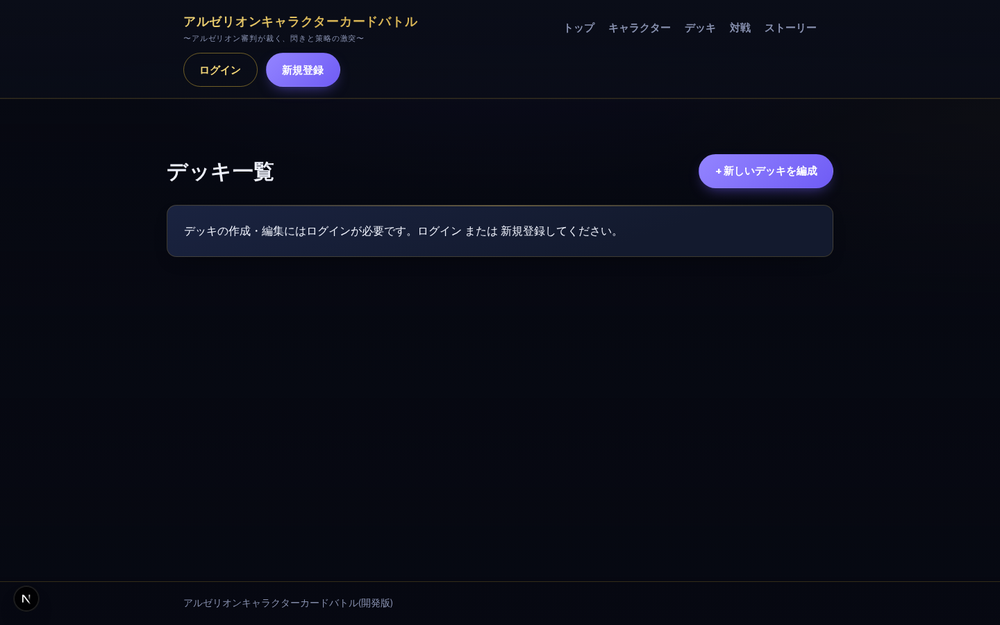
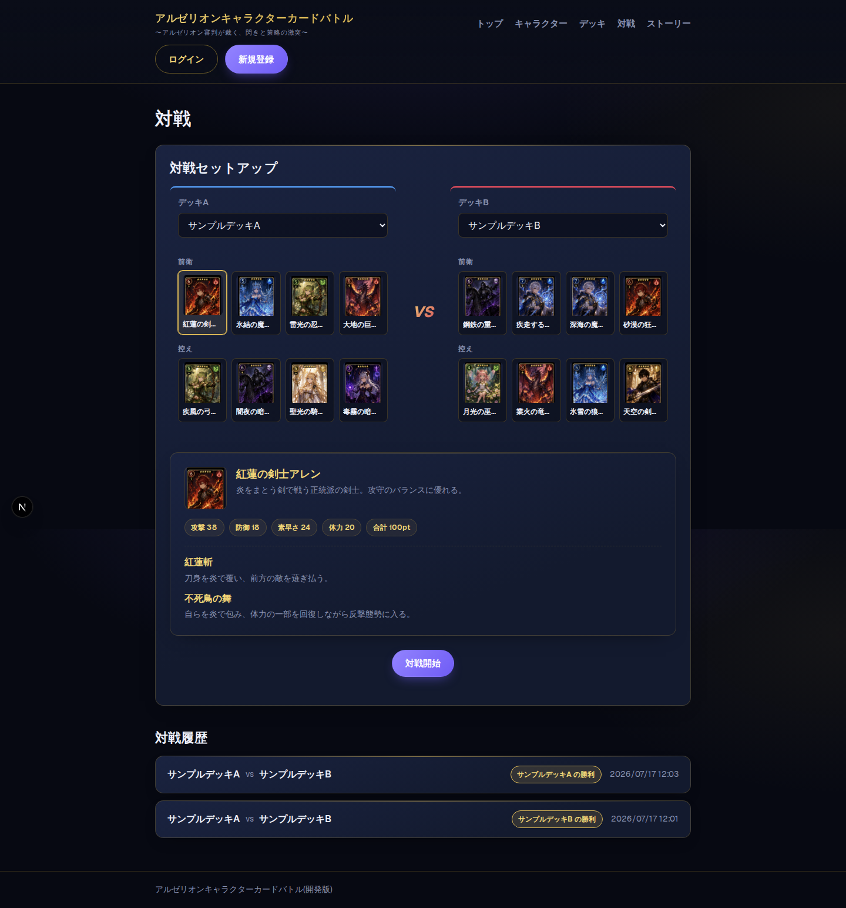
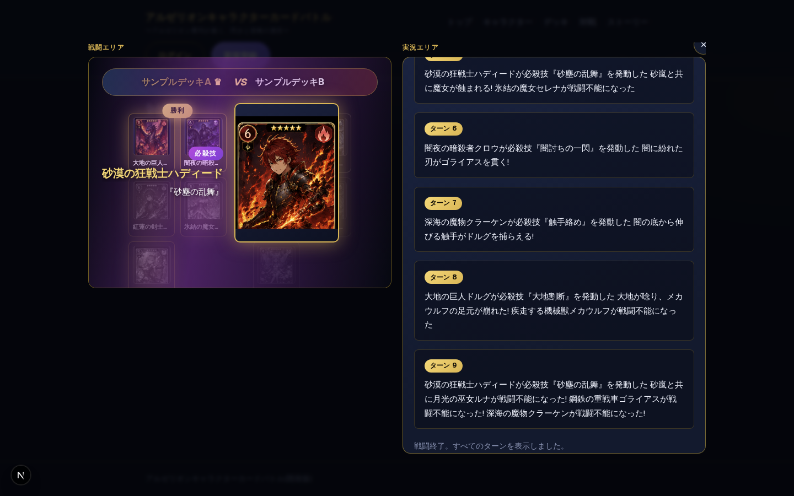
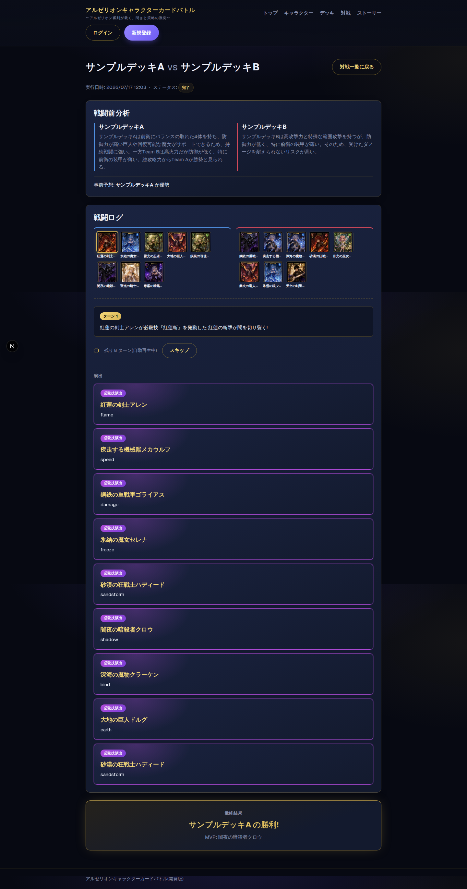
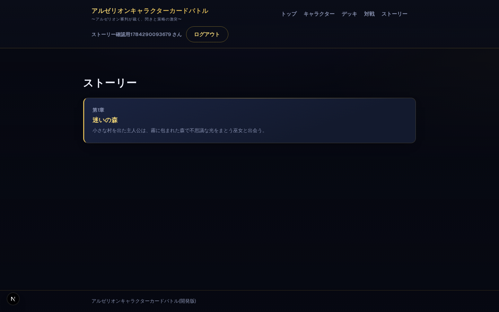
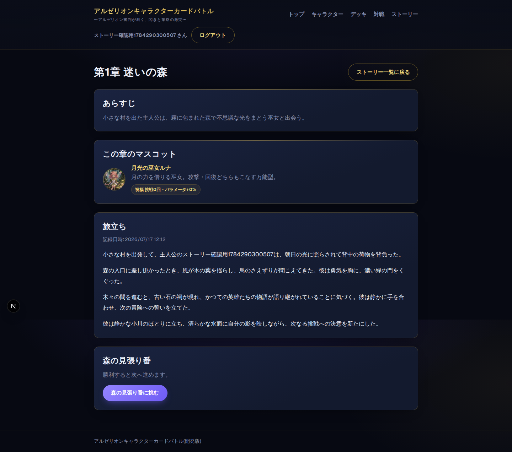

# 画面構成・UI部品名リファレンス

各画面・画面内の領域に「呼び方」を揃えるための一覧。実装コード(`globals.css`のBEMクラス名・コンポーネント名)を正として、画面キャプチャと突き合わせて整理した。開発中に「〇〇のところ直して」ではなく「対戦アリーナのカード部分」のように通じる名前で会話できることを目的とする。

## この文書の作り方・制約

- `npm run dev` で起動した実機をPlaywrightでスクリーンショットし、`src/app`・`src/components`・`globals.css`のコメント/クラス名と突き合わせて命名した。
- 作成時点(2026-07-17)は `PHP_BRIDGE_URL`(本番MySQL)が本セッションから疎通不可だったため、トップ/ログイン/新規登録以外の**データ取得を伴う画面は当初、実データ入りのキャプチャが撮れなかった**。
  - 対戦・ストーリーの画面は、`php/seed-data.json` のサンプルキャラクター・デッキを読み込む一時的なローカルモックブリッジ(このドキュメント作成専用、リポジトリには含めていない)に向けて撮り直し、実際にAI審判(Claude API)を呼び出して得られた戦闘ログ・分析・ストーリー本文を掲載している。
  - キャラクター一覧・デッキ一覧は未対応のままで、空データ/エラー表示のキャプチャ+実装コードの読み取りで領域構成を復元している。本番ブリッジ復旧後に実データで撮り直すとより分かりやすくなる。
  - このキャプチャ作業中に、`src/lib/claude/client.ts` が読み込む `システムプロンプト.md` のパスが(直近のフォルダ整理で `docs/` 配下へ移動したにもかかわらず)プロジェクトルート直下のままになっており、対戦・ストーリーのAI呼び出しが軒並み失敗するバグを発見し、`docs/システムプロンプト.md` を参照するよう修正済み。
- 画面キャプチャは `docs/画面キャプチャ/` に格納(代表的なもののみ。全画面ぶんではない)。

## ルート一覧

| パス | 画面名 | 実装ファイル |
|---|---|---|
| `/` | トップ | `src/app/page.tsx` |
| `/login` | ログイン | `src/app/login/page.tsx` + `LoginForm` |
| `/register` | 新規登録 | `src/app/register/page.tsx` + `RegisterForm` |
| `/characters` | キャラクター一覧 | `src/app/characters/page.tsx` |
| `/characters/new` | キャラクター作成 | `src/app/characters/new/page.tsx` + `CharacterForm` |
| `/characters/[id]/edit` | キャラクター編集 | `src/app/characters/[id]/edit/page.tsx` + `CharacterForm` |
| `/decks` | デッキ一覧 | `src/app/decks/page.tsx` |
| `/decks/new` | デッキ編成(作成) | `src/app/decks/new/page.tsx` + `DeckForm` |
| `/decks/[id]/edit` | デッキ編成(編集) | `src/app/decks/[id]/edit/page.tsx` + `DeckForm` |
| `/battles` | 対戦 | `src/app/battles/page.tsx` + `BattleSetupForm` |
| `/battles/[id]` | 対戦詳細 | `src/app/battles/[id]/page.tsx` |
| `/stories` | ストーリー一覧 | `src/app/stories/page.tsx` |
| `/stories/[id]` | ストーリー章詳細 | `src/app/stories/[id]/page.tsx` |

---

## 共通パーツ(全画面の土台)

サイト全体で使い回す部品。個別画面のセクションではここには書かず、都度この名前で参照する。

| 表示名 | クラス名・コンポーネント | 説明 |
|---|---|---|
| サイトヘッダー | `.site-header` (`Nav.tsx`) | ロゴ+メインナビ+認証エリアの帯 |
| ロゴ・タイトルロックアップ | `.site-logo` / `__title` / `__tagline` | 「アルゼリオンキャラクターカードバトル」+サブタイトル |
| メインナビ | `.site-nav` | トップ/キャラクター/デッキ/対戦/ストーリーへのリンク |
| 認証エリア | `.site-header__auth` / `__username` | 未ログイン=ログイン/新規登録ボタン、ログイン中=ユーザー名+ログアウト |
| サイトフッター | `.site-footer` (`layout.tsx`) | 「(開発版)」表記のみ |
| ページ背景 | `.page-bg` / `.page-bg__content` | トップ/キャラクター一覧/デッキ一覧で共通の背景画像レイヤー |
| ページヘッダー | `.page-header` | 見出し+右上の主要アクションボタン(一覧画面共通) |
| カード(汎用箱) | `.card` | 内容を囲む不透明パネル。ほぼ全セクションの土台 |
| バッジ | `.badge` (`--win` / `--fail` / `--pending` / `--system`) | ステータス・属性を示す小さなラベル |
| ボタン | `.button` (`-primary` / `-secondary`) | 全画面共通のボタンスタイル |
| フォーム項目 | `.form-field` | ラベル+入力欄1組 |
| フォームエラー | `.form-error` / `.form-error-banner` / `.form-error-list` | 単発エラー文/バナー/複数エラーの箇条書き |
| 一覧カードのアクション行 | `.card-actions` / `.card-actions__delete` | 編集・削除ボタンの並び(キャラクター/デッキ一覧で共通、`DeleteButton`) |
| エラー画面 | `src/app/error.tsx` | PHPブリッジ疎通不可時などに出る共通エラーバウンダリ(「エラーが発生しました」+再試行) |

---

## 1. トップページ `/`

`src/app/page.tsx`。3セクション構成。

| 領域名 | クラス名 | 説明 |
|---|---|---|
| ヒーローセクション | `.home-hero` | 左右のキャラ立ち絵+中央のタイトルブロック |
| ヒーロー装飾イラスト(左/右) | `.home-hero__character--left` / `--right` | サンプルキャラクター画像(装飾、リンクなし) |
| ヒーローコンテンツ | `.home-hero__content` / `__title` / `__tagline` / `__description` | タイトル・キャッチコピー・説明文 |
| 主要導線カード列 | `.home-cta` | 「キャラクター作成」「デッキ編成」「対戦する」の3枚 |
| 導線カード | `.home-cta__card--a/b/c` / `__icon` / `__title` / `__subtitle` | 各カード(アイコン+タイトル+一言) |
| ゲームの流れ | `.card.home-flow` | 3ステップの説明パネル |
| フローステップ | `.home-flow__step` / `__icon` | 「1. キャラクターを作る」等、番号付きステップ |

---

## 2. ログイン `/login`

`LoginForm.tsx`。認証系ページ共通の枠は `.auth-page`(見出し+`.auth-card`)。

| 領域名 | クラス名 | 説明 |
|---|---|---|
| 認証カード | `.card.auth-card` | ログインフォーム全体を囲む箱(登録画面とも共通) |
| ユーザー名・パスワード入力 | `.form-field` | 通常のフォーム項目 |
| パスワード再確認トグル | `.auth-card__recover-toggle` | 「パスワードを忘れた方はこちら」リンク |
| パスワード再確認フォーム | `.auth-card__recover` / `__recovered-password` | ユーザー名だけで平文パスワードを再表示する簡易問い合わせ欄 |

## 3. 新規登録 `/register`

`RegisterForm.tsx`。

| 領域名 | クラス名 | 説明 |
|---|---|---|
| 認証カード | `.card.auth-card` | ログインと共通 |
| 登録完了結果 | `.auth-result` / `__password` | 登録直後に一度だけ表示される自動発行パスワード |

---

## 4. キャラクター一覧 `/characters`

`src/app/characters/page.tsx`。未ログイン時はシステムキャラクターのみ表示(一覧自体は隠さない)。

| 領域名 | クラス名 | 説明 |
|---|---|---|
| キャラクターグリッド | `.character-grid` | カードを並べるグリッド |
| キャラクターカード | `.card.character-card` | 1体分の表示単位 |
| サムネイル | `.character-card__thumb` / `-placeholder` | 画像またはNo Image表示 |
| 名前・説明 | `.character-card__name` / `__desc` | — |
| ステータスバッジ列 | `.character-card__stats` | 合計pt・必殺技数・「システム」バッジ |
| アクション行 | `.card-actions` | 編集/削除(システムキャラクターは非表示) |

## 5. キャラクター作成・編集 `/characters/new`, `/characters/[id]/edit`

`CharacterForm.tsx`(作成/編集共通)+ `PointAllocator.tsx` + `SpecialMoveEditor.tsx`。

| 領域名 | クラス名・コンポーネント | 説明 |
|---|---|---|
| AI生成セクション | (`.card`見出し「AIにキャラクター案を考えてもらう」) | 作成時のみ表示。雰囲気を入力してAI生成→各欄に反映 |
| 基本情報セクション | (`.card`見出し「基本情報」) | 名前・説明・画像アップロード |
| 画像プレビュー | `.character-image-preview` | アップロード直後のサムネ+削除ボタン |
| パラメーター配分UI | `.point-allocator` | 合計100ptの配分エディタ(`PointAllocator`) |
| 　合計サマリー | `.point-allocator__summary` (`--over`で超過警告) | 合計/残りポイント表示 |
| 　パラメーター行 | `.point-allocator__row` / `__remove` | 名前+数値入力+削除ボタンの1行 |
| 必殺技編集UI | `.special-move-editor` | 任意0件〜の技リスト(`SpecialMoveEditor`) |
| 　必殺技行 | `.special-move-editor__row` / `-header` | 技名・説明・演出テキストの1件 |

## 6. デッキ一覧 `/decks`

`src/app/decks/page.tsx`。未ログインはログイン/新規登録の案内カードのみ(一覧自体は非表示)。

| 領域名 | クラス名 | 説明 |
|---|---|---|
| デッキグリッド | `.deck-grid` | カードを並べるグリッド |
| デッキカード | `.card.deck-card` | 1件分の表示単位 |
| 名前・作成者・作成日 | `.deck-card__name` / `__owner` / `__date` | — |

## 7. デッキ編成(作成・編集) `/decks/new`, `/decks/[id]/edit`

`DeckForm.tsx`(作成/編集共通)+ `DeckBuilder.tsx`。

| 領域名 | クラス名・コンポーネント | 説明 |
|---|---|---|
| 基本情報セクション | (`.card`見出し「基本情報」) | デッキ名・作成者名 |
| キャラクター選択UI | `.deck-builder` | ちょうど8体を選ぶチェックボックスリスト(`DeckBuilder`) |
| 　選択サマリー | `.deck-builder__summary` | 「選択中 x/8体」「前衛x/4・控えy/4」 |
| 　選択リスト行 | `.deck-builder__item` (`--selected`) / `-main` / `-name` | キャラクター名+ptバッジ+チェックボックス |
| 　前衛/控えトグル | `.deck-builder__role-toggle` / `__role-button` | 選択済みキャラのみ表示される役割切り替え |

---

## 8. 対戦 `/battles`

`src/app/battles/page.tsx` + `BattleSetupForm.tsx`。「対戦セットアップ」「対戦履歴」の2セクション+モーダルの「戦闘ポップアップ」で構成。

### 8-1. 対戦セットアップ

| 領域名 | クラス名 | 説明 |
|---|---|---|
| セットアップセクション | `.card.battle-setup-section` / `.battle-setup` | デッキ選択〜対戦開始ボタンまでの箱 |
| 対戦アリーナ | `.battle-arena` | デッキA/VS/デッキBの3カラム |
| チーム欄(A/B) | `.battle-arena__team--a` / `--b` | デッキ選択プルダウン+カード表示 |
| VS表示 | `.battle-arena__vs` | 中央の「VS」 |
| カード表示エリア | `.battle-arena__cards` / `__role-label`(前衛/控え) / `__card-row` | デッキ選択後に読み込まれる前衛4・控え4 |
| ミニカード | `.battle-arena__mini-card` (`--selected`) / `-thumb` / `-placeholder` / `-name` | クリックで下のカード詳細に反映する小カード |
| カード詳細パネル | `.card.battle-arena__detail` (`--empty`) | クリックしたキャラの説明・パラメーター・必殺技(閲覧専用、対戦結果に影響しない) |
| 対戦開始ボタン | `.battle-arena__action` | セットアップ末尾のボタン行 |

### 8-2. 対戦履歴

| 領域名 | クラス名 | 説明 |
|---|---|---|
| 履歴セクション | `.battle-history-section` / `.battle-history-list` | 一覧全体 |
| 履歴アイテム | `.card.battle-history-item` | クリックで戦闘ポップアップを再生(ページ遷移なし) |
| 対戦カード表示 | `.battle-history-item__matchup` / `__vs` | 「デッキA vs デッキB」 |
| メタ情報 | `.battle-history-item__meta` / `__date` + `.badge` | 勝敗/ステータスバッジ+日時 |

### 8-3. 戦闘ポップアップ(対戦・ストーリー戦闘で共通)

`BattlePopup.tsx`(内部に `BattleStage`)+ `BattleLogViewer.tsx` + `BattleEventCard.tsx`。対戦(`BattleSetupForm`)とストーリーの戦闘イベント(`StoryBattleButton`)の両方から呼ばれる共通モーダル。

| 領域名 | クラス名 | 説明 |
|---|---|---|
| モーダル外枠 | `.battle-modal-backdrop` / `.battle-modal` (`--result`) | 背景暗転+本体。結果表示前は閉じるボタン非表示 |
| 2カラムレイアウト | `.battle-modal__layout` / `__column` / `__column-label` | 結果表示後に「戦闘エリア」「実況エリア」の2列に分割 |
| **戦闘エリア**(`BattleStage`) | `.battle-stage` | 戦場背景画像の上にチーム名・カードを重ねる演出画面 |
| 　チーム名バナー | `.battle-stage__header` / `__team-label--a/b` (`--victory`) / `__vs` / `__crown` | 「デッキA VS デッキB」、決着後は勝者に王冠 |
| 　チーム列 | `.battle-stage__team-column` (`--victory` / `--defeat`) / `__victory-badge` | 左=デッキA、右=デッキB。決着後に金/沈み演出 |
| 　ステージ上のカード | `.battle-stage__card` / `-thumb` / `-name` | 前衛+途中参戦した控え(戦闘不能は末尾に移動) |
| 　ローディング演出 | `.battle-stage__loading` | 「アルゼリオンが戦況を裁定しています…」 |
| 　必殺技カットイン | `.battle-stage__cutin--left/right` / `-image` / `-text` / `-label` / `-name` / `-move` | 技発動時に一定時間だけ表示される大きな演出 |
| **実況エリア**(`BattleLogViewer`) | `.battle-log` | ターン送りで表示するテキストログ |
| 　ロースター | `.battle-roster` / `__team--a/b` / `.battle-roster__card` (`--acting` / `--defeated`) | 全キャラのカード一覧(対戦詳細ページのみ表示、ポップアップ内では非表示) |
| 　ターンブロック | `.battle-log__turn` / `-heading` / `.battle-log__message` | 「ターンN」+実況テキスト |
| 　演出イベント挿入部 | `.battle-log__turn-events` / `.battle-log__tail-events` | 該当ターン直後、または末尾の「演出」枠に挿入 |
| 　再生コントロール | `.battle-log__controls` | 自動再生中の残りターン数表示+「スキップ」 |
| 必殺技演出カード | `.battle-event-card` (`BattleEventCard`) | `__header` / `__badge` / `__character` / `__effect` / `__extra` |
| 戦闘前分析 | `.battle-detail__analysis-teams` / `__analysis-team--a/b` | 両者の戦力分析コメント |
| 最終結果バナー | `.battle-result-banner` / `__label` / `__winner` / `__mvp` | 勝者デッキ名+MVP |

## 9. 対戦詳細 `/battles/[id]`

`src/app/battles/[id]/page.tsx`。ページ遷移で開く常設版(ポップアップと違い `battle-roster` を表示)。

| 領域名 | クラス名 | 説明 |
|---|---|---|
| メタ情報 | `.battle-detail__meta` | 実行日時・ステータスバッジ |
| 処理中案内 | `.card.battle-detail__pending` | pending/running状態の案内(通常は発生しない想定) |
| 戦闘前分析セクション | `.card.battle-detail__analysis` | 8-3と同じ`.battle-detail__analysis-teams`を内包 |
| 戦闘ログセクション | `.card.battle-detail__log-section` | `BattleLogViewer`(ロースター表示あり) |

---

## 10. ストーリー一覧 `/stories`

`src/app/stories/page.tsx`。

| 領域名 | クラス名 | 説明 |
|---|---|---|
| 章リスト | `.story-list` | 章カードの並び |
| 章カード | `.card.story-card` (`--locked`) | ロック中はタイトル・あらすじ非表示 |
| 章カード見出し | `.story-card__header` / `__number` / `__title` / `__outline` | 「第N章」+タイトル+あらすじ |
| 振り返りセクション | `.card.story-history` / `.story-history-list` / `__item` / `__date` | プレイ済み章の一覧(ログイン中のみ) |

## 11. ストーリー章詳細 `/stories/[id]`

`src/app/stories/[id]/page.tsx` + `StoryPlayButton.tsx` + `StoryBattleButton.tsx`。章内のビート(`beatType: "story" | "battle"`)を順送りに表示。

| 領域名 | クラス名 | 説明 |
|---|---|---|
| あらすじセクション | `.card.story-detail__outline` | 章全体の大枠 |
| マスコットセクション | `.card.story-detail__mascot` / `-body` / `-thumb` / `-name` | 章のマスコットキャラ+「祝福」レベル表示 |
| デッキ作成案内 | `.story-detail__start` | 専用デッキ未作成時の案内 |
| ビートセクション(ストーリー) | `.card.story-detail__content` | 本文表示、未生成なら`StoryPlayButton`(「物語を始める」) |
| 挿絵 | `.story-detail__illustration` | ビートごとの挿絵画像 |
| ビートセクション(戦闘) | `.story-detail__battle` | `StoryBattleButton`(「〇〇に挑む」→戦闘ポップアップ、8-3と共通) |
| 本文 | `.story-detail__body` / `__meta` | 段落テキスト+記録日時 |

---

## 部品の再利用関係(まとめ)

同じ見た目・挙動を複数画面で使い回している部品。修正時は影響範囲として意識する。

- **`BattlePopup`(戦闘エリア/実況エリア)**: 対戦セットアップ(`BattleSetupForm`)とストーリー戦闘(`StoryBattleButton`)の両方から起動される共通モーダル。
- **`BattleLogViewer`**: 上記ポップアップ内(`showRoster=false`)と対戦詳細ページ(`showRoster=true`)の両方で使用。
- **`CharacterForm`/`DeckForm`**: 作成(`mode="create"`)と編集(`mode="edit"`)の両方で共通の1コンポーネント。
- **`.card` / `.badge` / `.button` / `.form-field`**: ほぼ全画面で使う最小単位のパーツ。命名に迷ったら「〇〇カード」「〇〇バッジ」で通じる。
- **`.page-bg`**: トップ・キャラクター一覧・デッキ一覧の3画面で共通の背景レイヤー(参考: `docs/参考画像/ゲーム画面イメージ/Top画面の背景イメージ.png`)。
